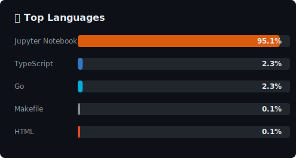

# 🌟 Welcome to My GitHub Profile! 🌟

### ✨ Passionate Developer | AI/ML Enthusiast | Problem Solver ✨

 

## 👋 About Me

<table align="center">
<tr>
<td valign="top" width="50%">

📍 **Location:** Bengaluru, India
🎓 **Student:** Enthusiastic learner
🚀 **Passion:** Artificial Intelligence & Machine Learning
💬 **Pronouns:** He/Him

</td>
<td valign="top" width="50%" align="center">

🎯 Constantly learning 🎯
🌱 Growing as a developer 🌱
💡 Building innovative solutions 💡
🔧 Exploring new technologies 🔧

</td>
</tr>
</table>

 

## 🎯 My Learning Journey

### 📚 Currently Mastering

### 🚀 My Expertise Areas

<table>
<tr>
<td align="center" width="15%">📊</td>
<td>
<strong>Data Analysis</strong> 
• Foundations of Data Analysis — mastering data manipulation &amp; visualization 
• Advanced Data Processing — expert techniques with Pandas 
• Statistical Analysis — deep dive into NumPy for ML implementations
</td>
</tr>
<tr>
<td align="center" width="15%">🤖</td>
<td>
<strong>Machine Learning</strong> 
• Exploring ML algorithms &amp; applications 
• Implementing mathematical concepts in Python 
• Building predictive models
</td>
</tr>
<tr>
<td align="center" width="15%">💻</td>
<td>
<strong>Development</strong> 
• Problem-solving with code 
• Clean &amp; efficient coding practices 
• Contributing to open-source
</td>
</tr>
</table>

 

## 🎨 Personal Interests

### ⚽ Soccer
*A passion that keeps me active & energized!*

### 🌧️ The Rain
*Brings inspiration & soothing creativity!*

 

## 📊 GitHub Statistics

 

## 🤝 Let's Connect!

### 💬 Find Me On

---

### 💝 Thank You For Visiting!

**Feel free to explore my projects, connect with me, or collaborate on exciting ideas!**

**Let's build something amazing together! 🚀✨**

